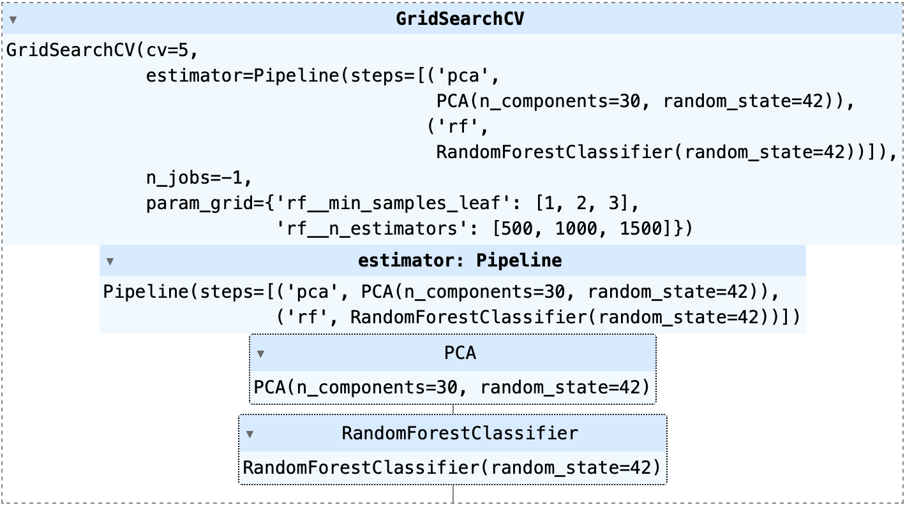

# Detection of Attacks on Power System Grids

**Author:**

Yuntian Xiao (yx6f20)

**Github:**

[QuintinShaw/COMP3217](https://github.com/QuintinShaw/COMP3217)

## I. Introduction

The purpose of this report is to delve into the application of machine learning methodologies for detecting potential attacks on power system grids. Early detection of network attacks can speed up response times and minimize potential damage.The tasks in Courseword include building a model for training using the provided dataset and then generating labels for different test datasets. These labels will specify whether or not an attack has occurred.

## II. Tools and Libraries Used

This project runs in a Python environment. It also uses Jupyter Notebooks. Several key Python libraries:

1. **Pandas**: It allows us to load and manage data efficiently. 
2. **NumPy**: It supports large-scale multidimensional arrays and matrices.
3. **Matplotlib**: A tool for visualization and presentation.
4. **Scikit-learn (sklearn)**: It provides tools for data pre-processing, model fitting, selection and evaluation.
5. **Random**: It can generate generate pseudo-random numbers.

## III. Data Preprocessing

In this project, I will utilize a CSV file as our data source, which will be pulled into a pandas DataFrame. this process constructs a two-dimensional, labeled table that is capable of handling a variety of data types.

Then, I consider the last column of the dataset as the label and the rest as the features, and divide the data into two different subsets using sklearn's `train_test_split` function. I assign 80% of the data to the training set, and use the remaining 20% as the validation set.

## IV. Model Creation and Parameter Optimization

This project uses a combination of Principal Component Analysis (PCA) and the Random Forest Classifier.

### PCA

PCA is a technique for dimensionality reduction, which becomes particularly handy when handling data that consists of a large number of features or dimensions. It functions by generating new uncorrelated variables that successively maximize variance. When applied to my data, PCA assists in filtering out noise and redundant features, thereby enhancing the efficiency and accuracy of my machine learning model.

### Random Forest Classifier

The Random Forest is an ensemble learning method that functions by constructing a multitude of decision trees during training and outputting the mode of the classes for classification problems. Its high flexibility and versatility make it a popular choice for machine learning algorithms.

In my model, I implement a pipeline that includes PCA and a Random Forest Classifier. The PCA is initialized with a fixed number of components, specifically 30, to decrease the dimensionality of my data. The Random Forest Classifier is incorporated into the pipeline without specifying parameters, as they will be adjusted later using GridSearchCV.

### Parameter Optimization

Model parameters form a critical part of machine learning algorithms and are learned from the data. However, there's another category of parameters known as Hyperparameters that cannot be directly learned from the regular training process. These parameters, such as the number of trees in a forest (n_estimators) or the minimum number of samples required at a leaf node (min_samples_leaf), express "higher-level" properties of the model like its complexity or its learning speed. Hyperparameters are typically set before the actual training process begins.

I establish a parameter grid for my Random Forest Classifier with 'n_estimators' values of [500, 1000, 1500] and 'min_samples_leaf' values of [1, 2, 3]. To discover the optimal combination of hyperparameters, I employ GridSearchCV, a method that performs an exhaustive search over specific parameter values for an estimator. GridSearchCV implements a “fit” and a “score” method and takes an estimator during construction. It then exposes an estimator API, allowing it to be used just like any other model in scikit-learn.

GridSearchCV for Task A

After fitting my data with GridSearchCV, it searches for the best parameters from the defined grid. In this case, the optimal parameters turned out to be 1 for 'min_samples_leaf' and 1000 for 'n_estimators'.

## V. Model Evaluation

Upon establishing the optimal model, the subsequent step is to evaluate its performance. It's crucial to note that I don't use the test data for this step yet. Instead, I use my validation set, which is a subset of the training data.

To evaluate the model, I compute various scores such as the model's accuracy, precision, recall, and F1-score on the validation set.

1. **Accuracy**: This is simply the ratio of correct predictions to the total number of predictions. In this case, the model's accuracy score on the validation set is approximately 0.99, which is a robust result.
2. **Precision**: Precision is the ratio of correctly predicted positive observations to the total predicted positives.
3. **Recall (Sensitivity)**: This is the ratio of correctly predicted positive observations to all observations in the actual class.
4. **F1-Score**: The F1 Score is the weighted average of Precision and Recall. It aims to find the balance between precision and recall.

Scores of Task A

Moreover, I also plot a confusion matrix, a table used to describe the performance of a classification model on a set of data for which the true values are known. The confusion matrix in this project demonstrates that my model has done an excellent job in correctly classifying the data.

Confusion Matrix of Task A

## VI. Model Testing

Upon tweaking and assessing my model, it's imperative to progress to the subsequent stage: introducing it to fresh, unseen data. The model has not been acquainted with this test data yet, making it an intriguing process to observe how the model responds to new instances absent during training. This delivers an honest insight into the model's potential real-world performance.

Within this project scope, my trained model is utilized to forecast outcomes on the test dataset. The model's verdict on the association of input data to a particular class manifests as a prediction array.

The model remains oblivious to the actual results of the test data (that is, it doesn't know the labels). It's relying on its training data learnings to make the most educated guesses.

Predictions of Task A

## VII. Results Analysis and Saving

Analyzing results forms an essential aspect of any machine learning task. It's not sufficient to merely print out some performance metrics. I should also delve deeper into my results, using all the tools available to me.

In this project, I append the predicted labels to my test dataset. Appending the predictions to the test data facilitates later result analysis. It's a simple way of keeping track of which inputs led to which predictions.

Finally, I store my test dataset, now enriched with the predictions, as a CSV file. This practice serves dual purposes - it helps keep track of my results and also facilitates sharing these outcomes with others or feeding them into another system for deeper examination.

CSV files

## VIII. Extension to Multi-Class Data

In the second part of the project, the process is repeated with a new dataset that comprises multiple classes. The process remains identical — data preprocessing, model creation and parameter optimization, model evaluation, and finally predictions and result saving.

GridSearchCV for Task B

The primary difference here is that instead of using PCA, I directly employ the Random Forest Classifier for creating my model. Also, since the data is multi-class, I ensure to calculate my metrics with the argument `average='macro'` to compute the metrics for each label and find their unweighted mean.

Scores of Task B

Confusion Matrix of Task B

The evaluation metrics and the confusion matrix offer insights about how well my model is performing not just overall, but also on each individual class. The model again achieves high scores on the metrics, demonstrating its effectiveness in classifying the multiclass data.

Predictions of Task B

The test predictions are saved in a similar manner as the binary class problem, and thus I complete a full cycle of machine learning, from loading data to saving predictions, for both binary and multi-class classification problems.

## IX. Model Improvement and Future Work

Despite the high performance of the models I trained, there is always scope for improvement. For instance, while I used the Random Forest algorithm due to its capability to handle complex datasets and produce reliable results, other algorithms might yield better outcomes.

## X. Conclusion

I've successfully applied machine learning strategies like Random Forest classification and Principal Component Analysis to build an efficient solution for identifying attacks on power system grids. The model performed remarkably well on both the training and testing sets, validating its strength and its broad applicability.

However, cybersecurity is a dynamic field, and threats will always emerge. Therefore, we need to continuously improve and adapt the model. Future endeavors could involve the incorporation of new machine learning methodologies or the addition of more sophisticated features to boost the predictive capacity of our model.

## XI. References

1. Python documentation, pandas, numpy, matplotlib, sklearn, and random libraries.
2. "Hands-On Machine Learning with Scikit-Learn, Keras, and TensorFlow" by Aurélien Géron. ISBN: 9781492032649
3. Course notes and lectures from COMP3217 at the University of Southampton.